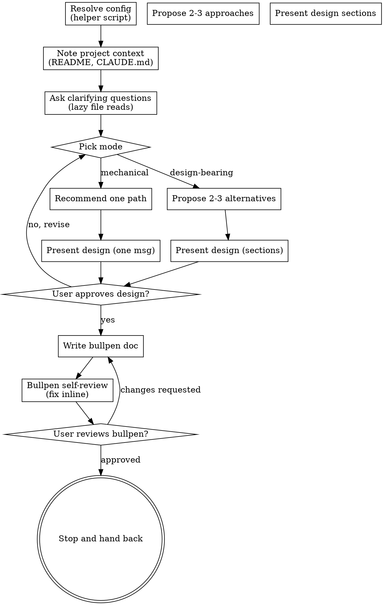

# Bullpen: Ideas Into Designs

Help turn ideas into fully formed designs through natural collaborative dialogue. The output is a small artifact called a *bullpen*: a design captured at the depth we honestly know it, no further. We don't write hundreds of lines of forward plan that won't survive contact with reality.

Start by understanding the current project context, then ask questions one at a time to refine the idea. Once you understand what you're building, present the design and get user approval.

<HARD-GATE>
Do NOT invoke any implementation skill, write any code, scaffold any project, or take any implementation action until you have presented a design and the user has approved it. This applies to EVERY project regardless of perceived simplicity.
</HARD-GATE>

## Output rule: ASCII only

All files this skill writes (the bullpen.md doc, any commit messages, any user-facing prose) MUST use ASCII characters only. No emoji, no em-dashes, no curly quotes, no arrows, no non-breaking spaces. Use `-` for dashes, `->` for arrows, `"` and `'` for quotes, `...` for ellipses. This keeps content portable across editors, terminals, and operating systems.

## Right-sizing the ritual

Every task gets a design check. The FORM of that check must scale to the task.

- **Mechanical / one-path** (file move, rename, refactor with no behavior change, config tweak, well-defined transformation): a few bullets describing what happens and one approval. No alternatives, no sectioning, no per-section gates. If you find yourself inventing 2-3 approaches to fill a slot, the task didn't need them - that's theater.
- **New feature / unsettled shape**: full ritual - 2-3 genuine alternatives, a sectioned design, per-section approval. The gates exist to catch divergence early on a long thought; they earn their weight here.

Anti-patterns:

- **"Three approaches" for a task that has one obvious path.** Don't manufacture alternatives. State the one path and recommend it.
- **Section-by-section approval on a 5-bullet design.** Approval gates are round-trips; on a short design they cost more than they save. Present the whole short design, ask once.
- **Skipping the design check entirely** because the task feels small. The check exists to surface unexamined assumptions; even "move 4 files" deserves one paragraph + approval.
- **Reading files the user did not name.** Especially: prospecting in `saveDir` or external notes vaults for "related" content. If a user-named path doesn't exist in the cwd, ask - don't search alternative locations. The user's reference is authoritative.

The skill stays valuable across the whole range by being honest about which mode the current task is in. Most of the design effort goes into matching the form to the work, not into producing more form.

## Checklist

You MUST create a task for each of these items and complete them in order:

1. **Resolve config** - run `python3 ${CLAUDE_PLUGIN_ROOT}/scripts/resolve-config.py` once. It merges `~/.bullpen.json` and `<repoRoot>/.bullpen.json` over defaults, derives the repo name, and returns JSON with `saveDir`, `commitBullpen`, `commitAtBat`, `nestUnderRepoName`, `autoContinue`, `repoName`, `effectiveSaveDir`, `repoRoot`, `lineupActive`, and `liveBullpens`. If exit code is non-zero, the cwd is not in a git repo while `nestUnderRepoName: true` - refuse to run and tell the user to either run from inside a git repo or set `nestUnderRepoName: false`. If neither config file exists, the script returns defaults; mention that `bullpen-setup` is available. `lineupActive` is `true` when any sibling bullpen folder under `effectiveSaveDir` already has a `lineup.md` - use it in step 8's hand-back message. Bullpen uses `commitBullpen` (not `commitAtBat`) for the file-write commit in step 6. See `configuration.md` only if you need the schema for an edge case.
2. **Note project context** - the harness usually loads `README.md` and `CLAUDE.md` already. Use those. Do NOT scan the tree, list files, read commits, or open other files yet - you don't know what's relevant until the user describes the work. Lazy reads come during the clarifying-questions phase, justified by what the user said.
3. **Ask clarifying questions** - one at a time, understand purpose, constraints, success criteria. **One of your first questions, unless context already makes it obvious, is the delivery shape**: will this work be pushed to a remote and merged via a PR, or kept local? Default assumption is local-only - more work stays on the local branch than goes through PR. Capture the answer in the bullpen doc (a one-line "Delivery: local-only" or "Delivery: push to remote, merge via PR" near the top is enough) so the agent doesn't drift into PR-shaped suggestions later when the user never asked for them. Reads must follow these rules:
   - Read **only paths the user explicitly named**, at the path they named (relative to the project working directory unless they gave an absolute path).
   - If a named path does not exist in the cwd, **ask the user** - do not go searching `saveDir`, notes vaults, sibling branches, or any other location for a "similar" file. The user's reference is the only authoritative source for what to read.
   - **`saveDir` is for writing bullpens, never for reading them.** Don't prospect there for related notes, prior bullpens, or anything else. If you need to know what bullpens exist, ask the user.
4. **Pick the right mode** - mechanical (one obvious path) or design-bearing (genuine alternatives exist). For mechanical, skip to step 5 with a brief recommendation, no alternatives. For design-bearing, propose 2-3 genuine approaches with trade-offs and your recommendation. Don't invent alternatives to fill a slot.
5. **Present design.** Mechanical tasks: one short message covering the whole design, then one approval. Design-bearing tasks: break into sections and ask after each section. Per-section gates are for long designs only - on a short design they're wasted round trips.
6. **Write bullpen doc** - save to `<effectiveSaveDir>/YYYY-MM-DD-<topic>/bullpen.md` (a folder per bullpen, with `bullpen.md` inside). If `commitBullpen` is `true` (default), commit the file. If `false`, leave it for the user to commit. Note: shared/central save dirs (notes vaults, etc.) are typically not git repos; `commitBullpen: false` is the right answer there.
7. **Bullpen self-review** - quick inline check for placeholders, contradictions, ambiguity, scope (see below).
8. **User reviews written bullpen** - ask user to review the file before stopping.
9. **Stop.** Do not auto-invoke any planning or implementation skill. Hand back control to the user.

## Process Flow

**The terminal state is stopping.** Do NOT invoke `writing-plans`, `north-star-planning`, `frontend-design`, `mcp-builder`, or any other skill at the end. Bullpen ends with the artifact saved and the user back in control. The user decides if and when to make any handoff.

## The Process

**Understanding the idea:**

- The harness usually has `README.md` and `CLAUDE.md` already loaded - work from those. Do not list directories, scan source, or read commits before the user has named the topic. When you do reach for a file, do it lazily, justified by something specific the user just said.
- Before asking detailed questions, assess scope: if the request describes multiple independent subsystems (e.g., "build a platform with chat, file storage, billing, and analytics"), flag this immediately. Don't spend questions refining details of a project that needs to be decomposed first.
- If the project is too large for a single bullpen, help the user decompose into sub-projects: what are the independent pieces, how do they relate, what order should they be built? Then bullpen the first sub-project through the normal design flow. Each sub-project gets its own bullpen cycle.
- For appropriately-scoped projects, ask questions one at a time to refine the idea.
- Early in the question phase, establish the delivery shape (local-only vs push+PR) unless the user has already made it clear. Default to local-only. This anchors how the agent talks about "completion" later - don't slip into "open a PR" / "push the branch" suggestions on local-only work.
- Prefer multiple choice questions when possible, but open-ended is fine too.
- Only one question per message. If a topic needs more exploration, break it into multiple questions.
- Focus on understanding: purpose, constraints, success criteria.

**Exploring approaches (only when alternatives genuinely exist):**

- If there are real, different paths to the goal, propose 2-3 with trade-offs.
- If there's one clear right way, just recommend it in a sentence and move on. Inventing fake alternatives is theater.
- When you do present alternatives, lead with the recommended option and explain why.

**Presenting the design:**

- Once you understand what you're building, present the design.
- Match the form to the task. Mechanical task: a few bullets, all in one message, one approval. Design-bearing task: sections, with per-section approval.
- Cover what's relevant. Skip what isn't - a file move doesn't need an "error handling" section, a UI redesign doesn't need a "data model" section. Standard topics for a substantial design: architecture, components, data flow, error handling, testing.
- Be ready to go back and clarify if something doesn't make sense.

**Right-sizing the artifact:**

- The bullpen captures what we honestly know. Constraints we can name, decisions we have actually made, components we are confident about.
- It is not a forward plan. Do not enumerate phases, milestones, or timeline estimates that you are guessing at. Anything past what you actually know is theater.
- If a section is best expressed as "we will figure this out when we get there", say so and move on.
- A short, honest bullpen beats a long, speculative one.

**Design for isolation and clarity:**

- Break the system into smaller units that each have one clear purpose, communicate through well-defined interfaces, and can be understood and tested independently.
- For each unit, you should be able to answer: what does it do, how do you use it, and what does it depend on?
- Can someone understand what a unit does without reading its internals? Can you change the internals without breaking consumers? If not, the boundaries need work.
- Smaller, well-bounded units are also easier for you to work with. You reason better about code you can hold in context at once, and your edits are more reliable when files are focused. When a file grows large, that is often a signal that it is doing too much.

**Working in existing codebases:**

- Once the topic is clear, read the specific files the user named, at the paths they named. Follow existing patterns. Don't pre-explore the whole tree "just in case" - that wastes context and slows the conversation.
- If a user-named path doesn't exist in the cwd, ask the user where it is. Never go prospecting in `saveDir`, notes vaults, sibling branches, or other paths for a "similar" file. The user's reference is the only authoritative source for what to read.
- Where existing code has problems that affect the work (e.g., a file that has grown too large, unclear boundaries, tangled responsibilities), include targeted improvements as part of the design, the way a good developer improves code they're working in.
- Don't propose unrelated refactoring. Stay focused on what serves the current goal.

## After the Design

**Documentation:**

- Write the validated bullpen to `<effectiveSaveDir>/YYYY-MM-DD-<topic>/bullpen.md`, using the `effectiveSaveDir` value from step 1's helper output. The folder gives every bullpen a place for related notes or companion-plugin artifacts (e.g., `lineup.md`).
- Use `elements-of-style:writing-clearly-and-concisely` skill if available.
- If `commitBullpen: true`, commit the bullpen document. If `false` (typical for shared/central save dirs that aren't git repos), leave it for the user.

**Bullpen Self-Review:**
After writing the bullpen document, look at it with fresh eyes:

1. **Placeholder scan:** Any "TBD", "TODO", incomplete sections, or vague requirements? Fix them.
2. **Internal consistency:** Do any sections contradict each other? Does the architecture match the feature descriptions?
3. **Scope check:** Is this focused enough for a single piece of work, or does it need decomposition?
4. **Ambiguity check:** Could any requirement be interpreted two different ways? If so, pick one and make it explicit.
5. **Speculation check:** Anything written as if known that is actually a guess? Either remove it or mark it explicitly as speculation.

Fix any issues inline. No need to re-review, just fix and move on.

**User Review Gate:**
After the bullpen review loop passes, ask the user to review the written file before stopping:

> "Bullpen written and committed to `<path>`. Please review it and let me know if you want to make any changes. When you are ready to start work or build a plan, kick off the next thing yourself."

If `lineupActive` was `true` in step 1's config output, append one short line to that message:

> "(Lineup is in use here - run `/lineup` when you're ready to fold this into the rolling work view.)"

Do NOT add the nudge when `lineupActive` is `false`. The nudge is a passive pointer, not a recommendation; never auto-invoke `lineup`.

Wait for the user's response. If they request changes, make them and re-run the review loop. Only stop once the user approves.

**Handing off:**

- The bullpen ends here. Do NOT invoke any planning or implementation skill.
- If the user has a follow-up planning skill they prefer (for example, `north-star-planning` or `writing-plans`), they will invoke it themselves.

## Key Principles

- **One question at a time.** Don't overwhelm with multiple questions.
- **Multiple choice preferred.** Easier to answer than open-ended when possible.
- **YAGNI ruthlessly.** Remove unnecessary features from all designs.
- **Explore alternatives only when they exist.** If the task has one obvious path, recommend it. Inventing 2-3 approaches for a one-path task is theater.
- **Right-sized validation.** Mechanical tasks: one approval on the whole short design. Design-bearing tasks: per-section approval. Don't gate small things.
- **Be flexible.** Go back and clarify when something doesn't make sense.
- **Honest about uncertainty.** A bullpen captures what we know, not what we're guessing.
