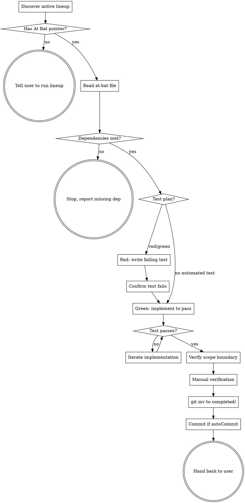

# At-Bat: Execute the Current Slot

Implements the unit of work described in the current At Bat file. Pairs
with the `lineup` skill, which sharpens the next at-bat. This skill does
the work. The two are deliberately separate so the user drives the loop.

<HARD-GATE>
This skill operates ONLY on the current At Bat file. It does not read
On Deck, In the Hole, or any future slot. It does not modify the lineup
state. It does not promote slots. When done, it stops — the user
invokes `lineup` next if they want to advance.
</HARD-GATE>

## TDD discipline (rigid)

This skill is a rigid TDD skill. Red → Green is not negotiable when the
at-bat has a Test plan section.

1. **Red first.** Write the failing test BEFORE implementation. Run it.
   Confirm it fails for the right reason (the new behavior is missing,
   not a syntax error).
2. **Green second.** Implement the smallest change that makes the test
   pass.
3. **No gold-plating.** Do not refactor, clean up, or add features past
   the at-bat's Definition of done. Anything outside scope goes back to
   the lineup as a future bullet — not into this at-bat.

If the at-bat's Test plan section says "No automated test", run the
manual verification steps explicitly (or ask the user to) and record the
outcome. Do NOT skip verification just because there's no automated
test.

## Anti-patterns

- **"While I'm here, let me also fix..."** No. The at-bat's Scope
  boundary section names what's Out. Respect it. If you find a real
  problem outside scope, surface it to the user and let them decide
  whether to add it to the lineup as a future at-bat.
- **"This test is hard to write, I'll skip it."** No. If the test is
  hard, that is a signal the design is unclear. Stop and re-read the
  at-bat. If the at-bat is genuinely untestable but the Test plan
  section claims red/green, push back to the user — the reviewer should
  have caught this.
- **"I'll just refresh the lineup at the end."** No. This skill does
  not invoke `lineup`. The user calls the next play.

## Checklist

Create a task for each item and complete in order:

1. **Discover active lineup.** Read `.spitball.json` (or use defaults)
   to get `saveDir`. Scan immediate children of `saveDir` for folders
   that contain `lineup.md` without a `Status: Complete` marker.
   - Zero live → tell user to run `lineup` (or `spitball` first if no
     spitball exists).
   - Exactly one live → use it.
   - Multiple live → ask the user which one.
2. **Read the lineup.** Find the At Bat pointer in `lineup.md`. If the
   At Bat slot is empty (no pointer), tell the user to run `lineup`
   first to sharpen one.
3. **Read the At Bat file.** This is the file `NNN-<slug>.md` referenced
   by the At Bat pointer. Confirm it has the required sections: What,
   Definition of done, Test plan, Scope boundary, Dependencies.
4. **Verify dependencies.** If the at-bat lists prior at-bats as
   dependencies, confirm those are in `completed/`. If a dependency
   isn't met, stop and tell the user.
5. **Red.** Write the failing test described in the Test plan. Run it.
   Confirm it fails for the expected reason. (Skip this step if the
   Test plan section is the "No automated test" form; instead, prepare
   the manual verification steps for execution after implementation.)
6. **Green.** Implement the smallest change that makes the test pass.
   Run the test. Confirm it passes.
7. **Verify scope boundary.** Re-read the Scope boundary section.
   Confirm your changes are entirely In, nothing Out. If you touched
   anything Out, revert that and surface it to the user as a candidate
   for a future at-bat.
8. **Manual verification (if applicable).** If the at-bat used the
   no-automated-test escape, run the manual steps now (or walk the user
   through them). Record the outcome inline at the bottom of the
   at-bat file under a `## Verification` header.
9. **Move file to `completed/`.** Use `git mv` so history is preserved.
   The filename does not change; only its location.
10. **Commit if `autoCommit` is true** (default). One commit covering
    the implementation, the test, and the file move. Suggested message:
    `At-bat NNN: <slug>`.
11. **Hand back to user.** Tell them the at-bat is complete and they
    can run `lineup` to sharpen the next one. Do NOT invoke `lineup`.

## Scope verification

Before committing, ask yourself:

- Did I touch any files not justified by the at-bat's What and
  Definition of done?
- Did I add behavior beyond what the test requires?
- Did I refactor unrelated code "while I was there"?

If yes to any, revert those changes. They are not part of this at-bat.
If they're worth doing, surface them to the user — the reviewer can add
them as future bullets.

## Process Flow

## Configuration

Read `.spitball.json` from the repo root. Use:

- `saveDir` — directory containing spitball folders. Defaults to
  `docs/spitballs/`.
- `autoCommit` — whether to commit the work after completion. Defaults
  to `true`.

There is no `.lineup.json`. Lineup and at-bat share spitball's config.

## Key principles

- **Red before green.** Always. Confirm the test fails first.
- **Smallest change to green.** Don't over-build.
- **Scope boundary is law.** What's listed Out stays Out.
- **One at-bat at a time.** This skill operates on the At Bat slot
  only. On Deck and In the Hole are not your business.
- **Never auto-invoke lineup.** When the at-bat is complete, stop. The
  user calls the next play.
- **Honest verification.** If there's no automated test, the manual
  steps must actually be run, not waved at.
