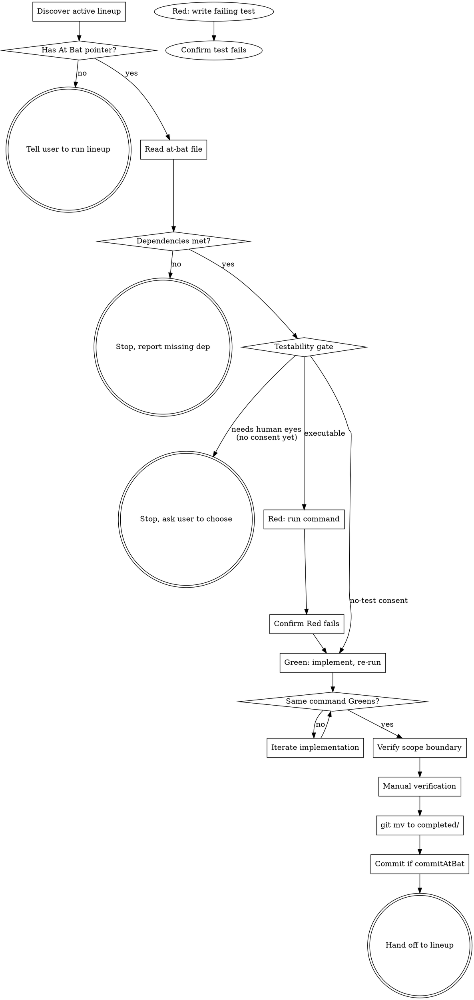

# At-Bat: Execute the Current Slot

Implements the unit of work described in the current At Bat file. Pairs
with the `lineup` skill, which sharpens the next at-bat. This skill does
the work. The two are deliberately separate so the user drives the loop.

<HARD-GATE>
This skill operates ONLY on the current At Bat file. It does not read
On Deck, In the Hole, or any future slot. It does not modify the lineup
state. It does not promote slots. When done, it MUST invoke `lineup` -
this handoff is mandatory and not user-configurable. Lineup is the
verifier of at-bat's self-reported completion; bypassing it lets a
broken at-bat ship as "done." It NEVER invokes any other implementation
skill.
</HARD-GATE>

## Output rule: ASCII only

All files this skill writes (test files, code edits, commit messages, the hand-off block) MUST use ASCII characters only. No emoji, no em-dashes, no curly quotes, no arrows, no non-breaking spaces. Use `-` for dashes, `->` for arrows, `"` and `'` for quotes, `...` for ellipses. This keeps content portable across editors, terminals, and operating systems.

## TDD discipline (rigid)

This skill is a rigid TDD skill. Red -> Green is not negotiable when the
at-bat has a Test plan section.

1. **Red first.** Write the failing test BEFORE implementation. Run it.
   Confirm it fails for the right reason (the new behavior is missing,
   not a syntax error).
2. **Green second.** Implement the smallest change that makes the test
   pass.
3. **No gold-plating.** Do not refactor, clean up, or add features past
   the at-bat's Definition of done. Anything outside scope goes back to
   the lineup as a future bullet - not into this at-bat.

**Red and Green should be the same command.** The only thing that
changes between them is the expected outcome. `dotnet test X` exits 1
before, exits 0 after. `curl http://localhost:5000/foo` returns 404
before, 200 after. `grep -q PATTERN file` returns 1 before, 0 after.
If you find yourself writing "Red: project doesn't exist" or "Red:
visual inspection," that is a sign the test is not yet a test - it's
an absence or a vibe. Reshape into a runnable command whose exit
code or output flips between Red and Green, or use the no-automated-
test escape and write a runnable manual procedure (see step 8).

If the at-bat's Test plan section says "No automated test", run the
manual verification steps yourself before deferring to the user. Do NOT
skip verification just because there's no automated test, and do NOT
default to "deferred to you" when you have the tools to run it.

**Default to executing.** Anything you can run from a shell counts as
executable, not manual:
- Starting a backend or dev server (background process is fine).
- `curl` against a URL, parsing the response.
- Running `dotnet test`, `pnpm test`, `npm run build`, etc.
- Grep / file-existence / build-output checks.
- Headless browser via `chrome-devtools` MCP if available.

Only defer to the user when the verification truly requires a human:
visual layout judgment that needs eyes on the screen, interactive UX
flows that headless tools can't drive, hardware-in-the-loop steps. When
deferring, name the specific reason ("requires visual inspection of the
new icon's alignment") instead of a generic "browser smoke test."

If you launch a background process for verification, kill it before
moving on - don't leave dev servers running.

## Anti-patterns

- **"While I'm here, let me also fix..."** No. The at-bat's Scope
  boundary section names what's Out. Respect it. If you find a real
  problem outside scope, surface it to the user and let them decide
  whether to add it to the lineup as a future at-bat.
- **"This test is hard to write, I'll skip it."** No. If the test is
  hard, that is a signal the design is unclear. Stop and re-read the
  at-bat. If the at-bat is genuinely untestable but the Test plan
  section claims red/green, push back to the user - the reviewer should
  have caught this.
- **"Browser smoke test deferred to you."** No, not by default. If the
  verification is "curl a URL and check the response," "load the build
  output and confirm the chunk emitted," or anything else a shell can
  do, run it yourself. Defer only when the step truly needs human eyes,
  and say *which* part needs them.
- **"I'll just refresh the lineup at the end."** No. This skill always
  hands off to lineup at the end (mandatory verification). It just does
  not perform the lineup's own promote logic itself.

## Checklist

Create a task for each item and complete in order:

1. **Discover active lineup.** Run
   `python3 ${CLAUDE_PLUGIN_ROOT}/scripts/resolve-config.py` once. Parse
   the JSON for `effectiveSaveDir`, `commitAtBat`, `autoContinue`, and
   `repoRoot`. Use `effectiveSaveDir` as the **discovery root**. If exit
   code is non-zero, the cwd is not in a git repo while
   `nestUnderRepoName: true` - refuse and tell the user.

   Scan immediate children of the discovery root for folders that
   contain `lineup.md` without a `Status: Complete` marker.
   - Zero live -> tell user to run `lineup` (or `spitball` first if no
     spitball exists).
   - Exactly one live -> use it.
   - Multiple live -> ask the user which one.
2. **Read the lineup.** Find the At Bat pointer in `lineup.md`. If the
   At Bat slot is empty (no pointer), tell the user to run `lineup`
   first to sharpen one.
3. **Read the At Bat file.** This is the file `NNN-<slug>.md` referenced
   by the At Bat pointer. Confirm it has the required sections: What,
   Definition of done, Test plan, Scope boundary, Dependencies.
4. **Verify dependencies.** If the at-bat lists prior at-bats as
   dependencies, confirm those are in `completed/`. If a dependency
   isn't met, stop and tell the user.
5. **Testability gate (BEFORE writing any code).** Look at the at-bat's
   Test plan and Definition of done. Decide:

   (a) Can the verification be expressed as a runnable command (or
       short script) whose exit code or output flips between Red
       and Green? Examples: `dotnet test X`, `curl URL`, `grep -q`,
       `npm run build`, `ls FILE`, `pnpm test`. This is the path -
       proceed to step 6 (Red).

   (b) Can it be expressed as runnable commands that YOU can execute
       (start a backend in the background, `curl`, kill the backend),
       even if it's not a test framework? Same path - treat the
       command(s) as the test and proceed.

   (c) Does the verification truly require human eyes or
       hardware-in-the-loop (visual layout judgment, animation feel,
       physical device, interactive UX)? STOP before writing code and
       surface this to the user with three options:

       1. **Restructure the at-bat** so a runnable check is possible
          (e.g., for "icon aligns with text," propose a screenshot
          diff or a CSS regression test as the actual check).
       2. **Skip TDD for this at-bat with eyes-open consent.** The
          user explicitly accepts that this one at-bat won't have
          a Red/Green - a deliberate exception, not an unexamined
          punt. Record the consent in the at-bat file.
       3. **Install or configure the missing tooling first.** This
          becomes its own at-bat (suggest adding it to the lineup);
          the current at-bat waits.

       Don't proceed to implementation until the user picks an option.
       Discovering "oh, I can't actually verify this" mid-implementation
       is the failure mode this gate exists to prevent.

6. **Red.** Run the chosen command. Confirm it fails for the expected
   reason (the new behavior is missing, not a syntax error or wrong
   path). If the at-bat is on the no-automated-test path with
   eyes-open consent, skip Red and prepare the manual verification
   procedure for step 9.
7. **Green.** Implement the smallest change that makes the command
   pass. Run it. Confirm the same command that was Red is now Green.
8. **Verify scope boundary.** Re-read the Scope boundary section.
   Confirm your changes are entirely In, nothing Out. If you touched
   anything Out, revert that and surface it to the user as a candidate
   for a future at-bat.
9. **Manual verification (if applicable).** If the at-bat used the
   no-automated-test escape, EXECUTE the manual steps yourself first.
   Anything shell-runnable counts as executable: launch a backend in
   the background, `curl` the URL, parse the response, run a build,
   inspect the output. See the "Default to executing" rules above the
   checklist.

   **Use the same command shape as Red and Green when possible.** If
   Red was "with backend down, `curl /foo` returns connection refused"
   and Green is "with backend up after this change, `curl /foo`
   returns 200," then verification re-runs the Green form. The flip
   between Red and Green is the test, even when there isn't a test
   framework involved.

   **If you genuinely cannot execute, propose a runnable command for
   the user.** Don't write "browser smoke test deferred to you." Write
   the exact procedure: the URLs, the start commands, the expected
   responses, what counts as pass and fail. The user should be able to
   paste your steps into a terminal and run them. Name the specific
   reason you couldn't run it yourself (not "manual verification" -
   "needs visual confirmation that the new icon aligns with the row
   text," or whatever the actual blocker is).

   Record the outcome (commands run, status codes, relevant output
   snippets, or the proposed-runnable-procedure if deferred) under a
   `## Verification` header at the bottom of the at-bat file. Kill any
   background processes you started.
10. **Move file to `completed/`.** Use `git mv` so history is preserved.
    The filename does not change; only its location.
11. **Commit if `commitAtBat` is true** (default). One commit covering
    the implementation, the test, and the file move. Suggested message:
    `At-bat NNN: <slug>`. The single-commit boundary matters: each
    at-bat should be revertable as one unit, so do not split this into
    multiple commits or fold it into an unrelated commit.
12. **Hand off to lineup for verification.** End your at-bat output
    with a short status block in EXACTLY this shape:

    ```
    ## At-bat NNN finished - handing to lineup for verification

    <2-5 bullet summary of what shipped: artifacts, build/test status,
    commit state, anything left uncommitted>
    ```

    Then immediately read `${CLAUDE_PLUGIN_ROOT}/skills/lineup/SKILL.md`
    and execute its checklist starting at step 1. Lineup's step 5 will
    detect your hand-off line and run verification mode against the
    just-completed at-bat. If verification passes, lineup promotes the
    next at-bat and applies its `autoContinue` rules. If verification
    fails, lineup stops with a failure report and does not promote.

    This handoff is mandatory - do not stop after the status block. Do
    NOT add a "Next step" line; lineup owns the user-facing
    call-to-action from here on.

## Scope verification

Before committing, ask yourself:

- Did I touch any files not justified by the at-bat's What and
  Definition of done?
- Did I add behavior beyond what the test requires?
- Did I refactor unrelated code "while I was there"?

If yes to any, revert those changes. They are not part of this at-bat.
If they're worth doing, surface them to the user - the reviewer can add
them as future bullets.

## Process Flow


```dot
digraph atbat {
    "Discover active lineup" [shape=box];
    "Has At Bat pointer?" [shape=diamond];
    "Tell user to run lineup" [shape=doublecircle];
    "Read at-bat file" [shape=box];
    "Dependencies met?" [shape=diamond];
    "Stop, report missing dep" [shape=doublecircle];
    "Testability gate" [shape=diamond];
    "Stop, ask user to choose" [shape=doublecircle];
    "Red: run command" [shape=box];
    "Confirm Red fails" [shape=box];
    "Green: implement, re-run" [shape=box];
    "Same command Greens?" [shape=diamond];
    "Iterate implementation" [shape=box];
    "Verify scope boundary" [shape=box];
    "Manual verification" [shape=box];
    "git mv to completed/" [shape=box];
    "Commit if commitAtBat" [shape=box];

    "Discover active lineup" -> "Has At Bat pointer?";
    "Has At Bat pointer?" -> "Tell user to run lineup" [label="no"];
    "Has At Bat pointer?" -> "Read at-bat file" [label="yes"];
    "Read at-bat file" -> "Dependencies met?";
    "Dependencies met?" -> "Stop, report missing dep" [label="no"];
    "Dependencies met?" -> "Testability gate" [label="yes"];
    "Testability gate" -> "Stop, ask user to choose" [label="needs human eyes\n(no consent yet)"];
    "Testability gate" -> "Red: run command" [label="executable"];
    "Testability gate" -> "Green: implement, re-run" [label="no-test consent"];
    "Red: write failing test" -> "Confirm test fails";
    "Red: run command" -> "Confirm Red fails";
    "Confirm Red fails" -> "Green: implement, re-run";
    "Green: implement, re-run" -> "Same command Greens?";
    "Same command Greens?" -> "Iterate implementation" [label="no"];
    "Iterate implementation" -> "Same command Greens?";
    "Same command Greens?" -> "Verify scope boundary" [label="yes"];
    "Verify scope boundary" -> "Manual verification";
    "Manual verification" -> "git mv to completed/";
    "git mv to completed/" -> "Commit if commitAtBat";
    "Commit if commitAtBat" -> "Hand off to lineup";
    "Hand off to lineup" [shape=doublecircle];
}
```

## Configuration

Run `python3 ${CLAUDE_PLUGIN_ROOT}/scripts/resolve-config.py` to get the
merged config. The script reads `~/.spitball.json` and
`<repoRoot>/.spitball.json` over defaults and returns JSON. See the
spitball plugin's `configuration.md` for the schema. At-bat uses:

- `effectiveSaveDir` - discovery root for the active lineup.
- `commitAtBat` - whether to commit the test+impl+file-move together
  after the at-bat passes (default `true`). Defaults to true so each
  at-bat is revertable as a single commit.
- `autoContinue` - passed through to lineup at hand-off; lineup decides
  whether to advance into the next at-bat after verifying.
- `repoRoot` - repo root path (used for `git mv` and commit operations).

There is no `.lineup.json`. Lineup and at-bat share spitball's config.

## Key principles

- **Red before green.** Always. Confirm the test fails first.
- **Smallest change to green.** Don't over-build.
- **Scope boundary is law.** What's listed Out stays Out.
- **One at-bat at a time.** This skill operates on the At Bat slot
  only. On Deck and In the Hole are not your business.
- **Never auto-invoke lineup.** When the at-bat is complete, stop. The
  user calls the next play.
- **Honest verification.** If there's no automated test, the manual
  steps must actually be run, not waved at.
