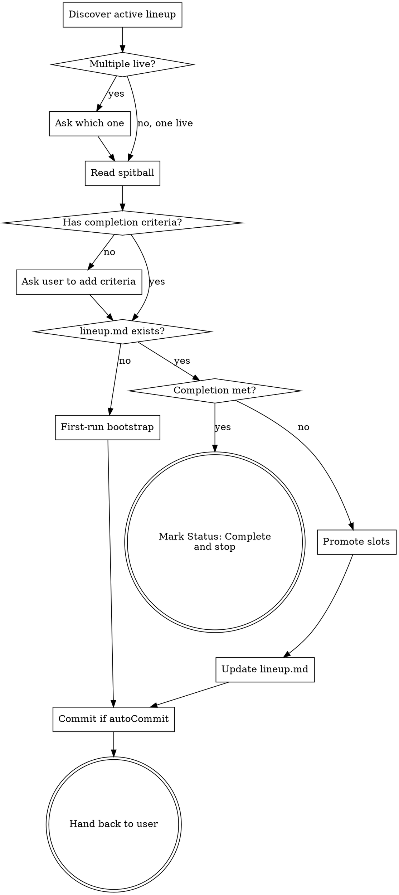

# Lineup: Review the Next Three Batters

Manages a small rolling state document next to a spitball. The spitball
owns the destination (the W). The lineup owns the next three batters: At
Bat (concrete), On Deck (fuzzy), In the Hole (very fuzzy). This skill
reads current state and updates the lineup. It does NOT do the work —
that is `at-bat`.

<HARD-GATE>
This skill never writes code, never invokes `at-bat` or any other
implementation skill, and never plans more than one new In the Hole bullet
per cycle. The user drives the loop.
</HARD-GATE>

## Anti-patterns

- **"Let me show you the whole roadmap."** No. Three slots, hard cap.
  Anything past In the Hole is in the dugout. The user can ask explicitly
  to see further out, but the default is three.
- **"This is small, I'll just implement it now."** No. The lineup skill
  only updates the lineup. If you find yourself wanting to write code,
  stop and tell the user to invoke `at-bat`.
- **"The In the Hole slot must be the last batter."** No. The lineup
  never reaches the end of itself. Completion is owned by the spitball.

## Checklist

Create a task for each item and complete in order:

1. **Discover active lineup.** Read `.spitball.json` (or use defaults) to
   get `saveDir`. Scan immediate children of `saveDir` for folders that
   contain a `spitball.md`. Among those, the "live" lineups are folders
   whose `lineup.md` does NOT begin with `Status: Complete`. (A folder
   without `lineup.md` yet counts as live; this is the first run.)
   - Zero live folders → stop and tell the user to run spitball first.
   - Exactly one live folder → use it.
   - Multiple live folders → ask the user which one to operate on.
2. **Verify spitball.md exists** in the target folder. If not, refuse
   to operate; tell the user lineup requires a spitball anchor.
3. **Read the spitball.** Identify the completion criteria. If the
   spitball doesn't state explicit completion criteria, ask the user to
   add them to the spitball before continuing — lineup can't determine
   "done" without them.
4. **Read or create `lineup.md`.** If absent, this is the first lineup
   cycle for this spitball: see "First-run bootstrap" below.
5. **Check completion.** Compare current state (codebase, recent
   commits, completed at-bats) against the spitball's completion
   criteria. If met → write `Status: Complete` at the top of `lineup.md`
   and stop. Tell the user the spitball is delivered.
6. **Promote.** Otherwise:
   - Promote On Deck → At Bat. Create the next `NNN-<slug>.md` file in
     the lineup folder with the full required structure (see "At-bat
     file structure" below). Counter is the next unused integer for this
     folder; never reuse, never reset.
   - Promote In the Hole → On Deck (inline bullet in `lineup.md`).
   - Draft a new In the Hole bullet. Exactly one. No more.
7. **Update `lineup.md`.** Replace the At Bat pointer with the new file
   name. Update the On Deck and In the Hole bullets. Append the
   previously-completed at-bat to the Completed list (its file should
   already be in `completed/` — that move is `at-bat`'s job, not yours).
8. **Commit if `autoCommit` is true** (default). Commit the new at-bat
   file and the updated `lineup.md` together with a short message like
   `Lineup: promote NNN-<slug>`.
9. **Hand back to user.** Do NOT invoke `at-bat`. Tell the user the
   lineup is sharpened and they can run `at-bat` when ready.

## First-run bootstrap

If `lineup.md` does not exist yet for a spitball:

1. Read the spitball carefully. Identify the first concrete unit of work
   the user could plausibly do toward the destination.
2. Identify two more units, progressively fuzzier.
3. Create `lineup.md` with all three slots filled:
   - **At Bat**: pointer to a new `001-<slug>.md` file (which you create
     with the full structure).
   - **On Deck**: inline bullet, fuzzy.
   - **In the Hole**: inline bullet, very fuzzy.
4. Confirm with the user before committing. First-run bootstrapping is
   the one place the reviewer is making structural decisions; the user
   should approve the initial three slots.

## At-bat file structure

When you create a new at-bat file (`NNN-<slug>.md`), it MUST contain:

```markdown
# At-Bat NNN: <title>

## What
<concrete description of the unit of work>

## Definition of done
<observable outcome that proves "done">

## Test plan
- Red: <a failing test that captures "done">
- Green: <expected behavior when it passes>

## Scope boundary
- In: <thing>
- Out: <related thing we are NOT touching here>

## Dependencies
- <prior at-bat or external thing>
```

If the work genuinely cannot be tested (pure docs, no-behavior config,
exploratory spike), replace the Test plan section with explicit honesty:

```markdown
## Test plan
- No automated test: <reason>
- Manual verification: <concrete steps>
```

**You MUST push back** on the no-test escape if the at-bat *could* be
tested. The escape is for cases where automated testing genuinely doesn't
fit, not for cases where it's inconvenient.

## `lineup.md` structure

```markdown
# Lineup: <topic>

Spitball: spitball.md

## At Bat
→ NNN-<slug>.md

## On Deck
- <fuzzy bullet, one sentence>

## In the Hole
- <very fuzzy bullet, one sentence>

## Completed
- NNN-<slug>.md
- NNN-<slug>.md
```

When the spitball's completion criteria are met, prepend `Status:
Complete` as the first line of the file. That marker is how a lineup
becomes inactive — there is no separate metadata.

## Process Flow



## Counter rules

- The counter is monotonic per lineup folder.
- The next counter is `max(NNN across all files in the folder + completed/) + 1`.
- Counters are zero-padded to three digits (`001`, `002`, ..., `099`,
  `100`).
- If a counter is abandoned (file deleted before completion), do NOT
  reuse it. The next promotion gets the next integer.

## Configuration

Read `.spitball.json` from the repo root. Use these values:

- `saveDir` — directory containing spitball folders. Defaults to
  `docs/spitballs/`.
- `autoCommit` — whether to commit the at-bat file and updated lineup.md
  after promotion. Defaults to `true`.

There is no `.lineup.json`. If a value isn't in `.spitball.json`, use the
default.

## Key principles

- **Three slots, hard cap.** Never four. Never two. Always exactly three
  (after the first promotion; first-run bootstrap also creates exactly
  three).
- **Filesystem is truth.** No pointer files, no json tracking, no
  metadata sidecar. The folder structure and the markdown contents are
  the state.
- **Spitball owns completion.** You read the criteria; you don't define
  them. If the spitball lacks criteria, push it back to the user.
- **Honest about uncertainty.** On Deck is fuzzy on purpose. In the Hole
  is fuzzier on purpose. Don't write paragraphs about either — a
  sentence per slot is the budget.
- **Never auto-invoke at-bat.** The skill ends with the lineup
  sharpened. The user picks up from there.
