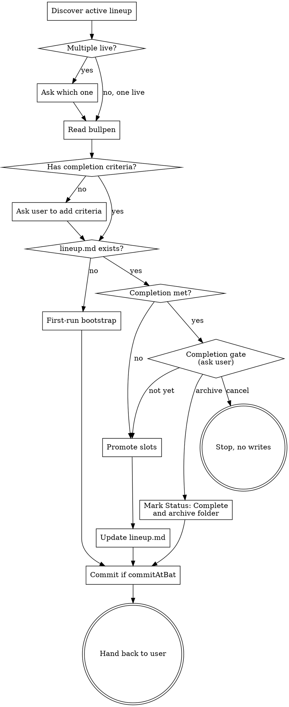

# Lineup: Review the Next Three Batters

Manages a small rolling state document next to a bullpen. The bullpen
owns the destination (the W). The lineup owns the next three batters: At
Bat (concrete), On Deck (fuzzy), In the Hole (very fuzzy). This skill
reads current state and updates the lineup. It does NOT do the work -
that is `at-bat`.

<HARD-GATE>
This skill never writes code and never plans more than one new In the
Hole bullet per cycle. When invoked at the end of an at-bat run, it
MUST verify the just-completed at-bat's Definition of done before
promoting (see "Verification mode" below). When the bullpen's
completion criteria appear met, lineup MUST ask the user to confirm
before archiving (see "Completion gate" below); only after explicit
confirmation may it write `Status: Complete` and move the bullpen
folder into `<effectiveSaveDir>/completed/<folder>/` (see "Completion
archive" below). `autoContinue` does NOT bypass the completion gate -
it governs the at-bat loop, not the archive decision. At first-run
bootstrap, lineup MAY run `git worktree add` if the user opts in to
worktree use (see "Worktree decision" below); on completion archive
(post-gate) it MAY run `git worktree remove` to tear that worktree
down. Those are the only filesystem/git mutations it performs. It MAY
invoke `at-bat` at the end of the hand-back, and only when the user
has opted in via `autoContinue` (`"always"`, `"session"` for this
conversation, or `"yes"` at the per-handoff prompt). It NEVER
invokes any other implementation skill. The user always drives the
loop - `autoContinue` is a shortcut for typing the next command,
not a license to chain.
</HARD-GATE>

## Output rule: ASCII only

All files this skill writes (`lineup.md`, at-bat files, commit messages, user-facing prose) MUST use ASCII characters only. No emoji, no em-dashes, no curly quotes, no arrows, no non-breaking spaces. Use `-` for dashes, `->` for the At Bat pointer, `"` and `'` for quotes, `...` for ellipses. This keeps content portable across editors, terminals, and operating systems.

## Anti-patterns

- **"Let me show you the whole roadmap."** No. Three slots, hard cap.
  Anything past In the Hole is in the dugout. The user can ask explicitly
  to see further out, but the default is three.
- **"This is small, I'll just implement it now."** No. The lineup skill
  only updates the lineup. If you find yourself wanting to write code,
  stop and tell the user to invoke `at-bat`.
- **"The In the Hole slot must be the last batter."** No. The lineup
  never reaches the end of itself. Completion is owned by the bullpen.

## Checklist

Create a task for each item and complete in order:

1. **Discover active lineup.** Run
   `python3 ${CLAUDE_PLUGIN_ROOT}/scripts/resolve-config.py` once. Parse
   the JSON for `effectiveSaveDir`, `commitAtBat`, `autoContinue`,
   `repoRoot`, and `liveBullpens` (an array of `{name, path, mtime}` for every folder
   under `effectiveSaveDir` that has a `bullpen.md` and is not marked
   `Status: Complete`, sorted by mtime descending - most recently
   touched first). If exit code is non-zero, the cwd is not in a git
   repo while `nestUnderRepoName: true` - refuse and tell the user.

   **Try to infer the target from chat context before asking.** Look at
   the conversation so far: did the user just run `/bullpen` and create
   a folder? Did they mention a slug, topic, or path that matches a
   `liveBullpens[*].name`? If a clear match exists, announce it ("Picking
   up the `<name>` bullpen from earlier in this chat - say if that's
   wrong.") and use it without prompting. Inference rules:
   - Exact slug or path match in recent messages -> use it, announce.
   - Topic words match a folder name (e.g., user said "the auth
     rewrite" and `2026-05-04-auth-rewrite` is live) -> use it, announce.
   - The most recent message in this session was a `/bullpen`
     hand-back referencing a folder under `effectiveSaveDir` -> use it,
     announce.
   - Ambiguous or no chat signal -> fall through to the rules below.

   Without a chat-context match:
   - Zero `liveBullpens` -> stop and tell the user to run bullpen first.
   - Exactly one -> use it.
   - Multiple -> list the names (most recent first) and ask the user
     which one to operate on.
2. **Verify bullpen.md exists** in the target folder. If not, refuse
   to operate; tell the user lineup requires a bullpen anchor.
3. **Read the bullpen.** Identify the completion criteria. If the
   bullpen doesn't state explicit completion criteria, ask the user to
   add them to the bullpen before continuing - lineup can't determine
   "done" without them.
4. **Read or create `lineup.md`.** If absent, this is the first lineup
   cycle for this bullpen: see "First-run bootstrap" below.
5. **Verification mode (when invoked from at-bat).** If the immediately
   prior assistant turn was an at-bat hand-back ("At-bat NNN finished -
   handing to lineup for verification"), verify that at-bat's
   Definition of done before promoting. See "Verification mode" below.
   If verification fails, stop with a failure report; do NOT promote
   and do NOT write to `lineup.md`. If verification passes, continue.
   When invoked directly by the user (no at-bat hand-back in the prior
   turn), skip this step - the user is asserting prior state is correct.
6. **Check completion.** Compare current state (codebase, recent
   commits, completed at-bats) against the bullpen's completion
   criteria. If criteria appear met -> run the completion gate (see
   "Completion gate" below). Only after the user explicitly confirms
   `archive` do you write `Status: Complete` at the top of `lineup.md`,
   archive the folder (see "Completion archive" below), and skip ahead
   to step 9 (commit) and step 10 (hand-back). Steps 7-8 (promotion)
   are not run on a confirmed-complete archive. If the user replies
   `not yet`, fall through to step 7 (promote slots) and continue the
   loop normally - do not write `Status: Complete`, do not move the
   folder. If the user replies `cancel`, stop entirely with no writes.
7. **Promote.** Otherwise:
   - Promote On Deck -> At Bat. Create the next `NNN-<slug>.md` file in
     the lineup folder with the full required structure (see the
     `templates/at-bat.md` sidecar). Counter is the next unused integer for this
     folder; never reuse, never reset.
   - Promote In the Hole -> On Deck (inline bullet in `lineup.md`).
   - Draft a new In the Hole bullet. Exactly one. No more.

   **Honor user direction.** If the user's invoking message included
   specific direction for the next at-bat ("the next at-bat should
   use a multiselect combobox with chips", "this one is Vue test only",
   "have the next slot wire up the keyboard handler"), incorporate it
   into the new at-bat's What / Definition of done / Test plan / Scope
   boundary rather than inferring from the bullpen alone. The user is
   the source of truth; lineup's job is to shape, not to outvote. If
   the direction conflicts with the bullpen's stated destination,
   surface the conflict back to the user before writing.
8. **Update `lineup.md`.** Replace the At Bat pointer with the new file
   name. Update the On Deck and In the Hole bullets. Append the
   previously-completed at-bat to the Completed list (its file should
   already be in `completed/` - that move is `at-bat`'s job, not yours).
9. **Commit if `commitAtBat` is true** (default). Commit the new at-bat
   file and the updated `lineup.md` together with a short message like
   `Lineup: promote NNN-<slug>`. The lineup file lives alongside the
   at-bat work in the loop's commit history, so it shares the same flag.
   On completion (step 6), the commit also captures the folder move into
   `completed/`; use a message like `Lineup: <topic> complete (archived)`.
10. **Hand back to user.** End your message with a hand-back block in
   EXACTLY this shape so the call-to-action is impossible to miss:

   ```
   ## Lineup sharpened

   <2-4 bullet summary of what changed: new At Bat, On Deck, In the Hole,
   commit state>

   ---

   **Next step:** run `/at-bat` to play NNN-<slug>.
   ```

   On first-run bootstrap, replace the header with `## Lineup bootstrapped`
   and the summary with the three slots you just filled. On completion,
   replace the block with a `## Bullpen delivered` header, list the new
   archive path (`Archived to <effectiveSaveDir>/completed/<folder>/`),
   and replace the Next-step line with a single passive pointer:
   `Optional: run /postmortem to reflect.` The loop is over - do not
   prompt or auto-continue.

   The `---` rule and bold **Next step:** line are required - they are
   the visual anchor that tells the user the loop is paused waiting for
   them.

   **Honor `autoContinue`** (from step 1's helper output, or from earlier
   in this conversation if the user said "session" at a prior prompt):

   - `"never"` -> end with the hand-back block above and stop. The user
     types `/at-bat` themselves.
   - `"prompt"` (default) -> after the hand-back block, ask:
     `Continue to /at-bat? (yes / session / always / no)`. On `yes` ->
     invoke at-bat now. On `session` -> invoke at-bat now and treat
     `autoContinue` as `"always"` for the rest of this conversation. On
     `always` -> invoke at-bat now AND write `autoContinue: "always"`
     into `<repoRoot>/.bullpen.json` (creating it if absent), so the
     setting persists across sessions for this repo. On `no` -> stop.
   - `"always"` -> skip the prompt, just invoke at-bat directly after the
     hand-back block. The user can interrupt at any time.

   This is the only place lineup may invoke at-bat. The hard gate above
   stays in force everywhere else: never auto-invoke when the user
   hasn't opted in via `autoContinue`.

## First-run bootstrap

If `lineup.md` does not exist yet for a bullpen:

1. Read the bullpen carefully. Identify the first concrete unit of work
   the user could plausibly do toward the destination.
2. Identify two more units, progressively fuzzier.
3. Create `lineup.md` with all three slots filled:
   - **At Bat**: pointer to a new `001-<slug>.md` file (which you create
     using the `templates/at-bat.md` sidecar).
   - **On Deck**: inline bullet, fuzzy.
   - **In the Hole**: inline bullet, very fuzzy.
4. **Worktree decision** (see "Worktree decision" below). Ask the user
   whether to run this bullpen in a git worktree. Recommend `yes` if
   the bullpen's scope looks substantial (multiple at-bats, broad
   surface area, risky changes); recommend `no` for small, contained
   bullpens. If the user opts in, create the worktree and prepend a
   `Worktree:` header to `lineup.md`.
5. Confirm with the user before committing. First-run bootstrapping is
   the one place the reviewer is making structural decisions; the user
   should approve the initial three slots.

## Worktree decision

A worktree decision is made once, at first-run bootstrap, and applies
to every at-bat in the bullpen. Lineup is the only skill that creates
the worktree; at-bat reads the `Worktree:` header from `lineup.md` and
operates inside that path.

When to recommend a worktree:

- The bullpen's scope spans multiple at-bats and is likely to touch
  files outside a single area.
- The work is risky or speculative and the user benefits from a
  clean branch they can throw away.
- The user is currently mid-flight on another branch in the main
  checkout and shouldn't have to stash/switch.

When to skip a worktree:

- The bullpen is small (one or two at-bats) and contained.
- The work is a quick fix or a doc change.
- The bullpen folder lives outside any git repo (`repoRoot` is null).

Procedure when the user opts in:

1. **Pick a branch name.** Default: the bullpen folder's slug with
   the leading `YYYY-MM-DD-` stripped. Offer this default and let the
   user override.
2. **Pick a worktree path.** Default: `<repoRoot>/../worktrees/<slug>`
   (sibling-of-repo). Confirm with the user; their workflow may want
   it elsewhere.
3. **Run** `git -C <repoRoot> worktree add <path> -b <branch>`. If
   the branch already exists, drop the `-b` and add it as a
   pre-existing branch instead. If the path already exists, stop and
   ask the user.
4. **Prepend** `Worktree: <path>` as the first line of `lineup.md`
   (above any other content, including a future `Status: Complete`
   marker - those compose as two header lines).
5. **Mention the worktree in the hand-back** so the user knows where
   to `cd` if they want to inspect work in progress.

When the user declines, do nothing. No `Worktree:` header is written;
at-bat will run from the current cwd as usual.

## Verification mode

When step 5 detects you were invoked from at-bat (the prior assistant
turn ended with "At-bat NNN finished - handing to lineup for
verification"), run these checks before promoting:

1. **Locate the at-bat file.** The just-completed at-bat is the
   most-recently-modified file in `completed/` for the active lineup.
   Confirm it exists and that the lineup folder's `lineup.md` still
   references it as At Bat (i.e., at-bat moved the file but lineup hasn't
   yet updated the pointer - that's exactly the state lineup is here to
   resolve).
2. **Read the Definition of done section.** Each line is a criterion to
   check.
3. **Verify each criterion concretely.** Don't just read; check.
   - File-existence claims -> confirm the file exists.
   - Build claims (`dotnet build` clean, `npm run build` succeeds) ->
     re-run the named command. Capture exit status.
   - Test claims -> re-run the named test command. Ideally this is the
     SAME command at-bat ran for Red and Green; only the expected exit
     code/output flips.
   - Grep claims (e.g., "no remaining `StaticPlugin*` references") ->
     re-run the grep.
   - Behavior claims that can be made executable (start a backend in
     the background, `curl`, kill the backend) -> run them yourself.
     Don't accept "deferred to user" if you have the tools.
   - Behavior claims with eyes-open no-test consent (recorded in the
     at-bat's `## Verification` section) -> trust the consent and skip
     those checks. The user accepted the exception explicitly.
   - Behavior claims that genuinely require human eyes (visual layout,
     interactive UX) -> the at-bat should have left a runnable
     verification procedure in its `## Verification` section. Re-state
     it concisely and ask the user to confirm. Don't silently mark
     "done."
4. **Verify the at-bat's Scope boundary.** Glance at the diff (or
   `git status` since the prior commit, if `commitAtBat: true` was on)
   and confirm nothing listed in the Scope boundary's Out section was
   touched. If something Out was touched, that's a verification failure.
5. **Decide.**
   - All criteria met, scope respected -> continue to step 6 (Check
     completion). Note in your hand-back: "Verified at-bat NNN: <list of
     checks that passed>."
   - Any criterion fails -> STOP. Output a verification-failure report:
     header `## Verification failed for at-bat NNN`, list of failed
     checks with specifics (command output, missing files, scope leaks).
     Do NOT update `lineup.md`. Do NOT promote. Do NOT invoke at-bat.
     The user fixes the issue and re-invokes lineup, or moves the file
     back out of `completed/` to redo the at-bat.

When invoked directly by the user (no at-bat hand-back in the prior
turn), skip verification - the user is asserting the prior state.

## Completion gate

Lineup never archives a bullpen on its own judgment. Before any
`Status: Complete` write, folder rename, worktree removal, or archive
commit, lineup MUST ask the user to confirm.

`autoContinue` does NOT bypass this gate. The at-bat loop autopilot
governs whether lineup invokes at-bat between cycles; it has nothing
to say about whether the bullpen is finished. Treating `"always"` as
license to archive turns a fuzzy judgment call into a silent burial.

Procedure:

1. **Show your work.** Print each completion criterion from the
   bullpen verbatim, and next to it the concrete evidence you're
   using to call it met: the at-bat that delivered it, the commit
   SHA, the file path, the test that's now passing, the grep that
   comes up empty. One line of evidence per criterion. If a
   criterion's evidence is weak ("seems done", "probably covered by
   003"), say so plainly - that is exactly the kind of judgment the
   user needs to see before saying yes.
2. **Ask.** End with the literal prompt:
   `Completion criteria look met. Archive the bullpen now? (archive / not yet / cancel)`
3. **Branch on the reply.**
   - `archive` -> proceed with the Completion archive procedure below.
   - `not yet` -> the user disagrees with one or more criteria, or
     wants more work first. Fall through to step 7 (promote slots)
     and continue the normal loop. Do NOT write `Status: Complete`.
     Do NOT move the folder. Do NOT remove the worktree.
   - `cancel` -> stop entirely. Do not promote, do not archive, do
     not commit. The user wants to think about it.
4. **No silent ratification.** Never treat absence of objection,
   `autoContinue: "always"`, or a previous session's `archive`
   confirmation as standing consent for the current archive. If the
   reply is ambiguous, ask again with the same three options.

## Completion archive

This section runs only after the Completion gate has been answered
`archive`. Do not enter it on Claude's judgment alone.

When step 6 detects the bullpen's completion criteria are met AND the
user has confirmed `archive`, lineup writes `Status: Complete` at the
top of `lineup.md` AND moves the bullpen folder out of the live area
so the file tree (and Obsidian / IDE previews) stays focused on
in-flight work.

Procedure:

1. **Update `lineup.md` in place** at the current location, prepending
   `Status: Complete` per the lineup template's "Completed lineup"
   section. Do this before the move so the move is a clean rename.
2. **Ensure the archive bucket exists.** If
   `<effectiveSaveDir>/completed/` is missing, create it. The bucket
   is a flat directory of completed bullpen folders; do not nest by
   year or topic.
3. **Move the folder.** Rename
   `<effectiveSaveDir>/<folder>/` to
   `<effectiveSaveDir>/completed/<folder>/`. If `commitAtBat` is true,
   use `git mv` so history follows. If false, use a plain rename.
4. **Refuse on collision.** If
   `<effectiveSaveDir>/completed/<folder>/` already exists, stop and
   tell the user; do not overwrite. Manual resolution required.
5. **Commit (if `commitAtBat` is true)** with a message like
   `Lineup: <topic> complete (archived)`. The commit captures both
   the `Status: Complete` edit and the rename.

The archive bucket is reserved: bullpens must not be named
`completed`. The resolve-config scan treats a top-level `completed/`
folder without its own `bullpen.md` as the bucket and walks one level
down for archived folders.

If `lineup.md` carries a `Worktree:` header, remove the worktree as
part of archival:

1. Strip the `Worktree:` header from `lineup.md` (the line is gone
   in the completed form; only `Status: Complete` remains at the top).
2. Run `git -C <repoRoot> worktree remove <path>`. If the worktree
   has uncommitted changes, this fails - stop and tell the user. They
   can either commit/discard and re-invoke lineup, or remove the
   worktree manually with `--force`.
3. Note the removal in the hand-back ("Worktree at `<path>` removed")
   so the user knows the cleanup happened.

The branch the worktree was on is left intact so the user can merge
or delete it on their own schedule.

## Templates

When creating files, copy from the template sidecars:

- New at-bat file (`NNN-<slug>.md`) -> see
  `${CLAUDE_PLUGIN_ROOT}/skills/lineup/templates/at-bat.md`. It covers
  both the standard Red/Green form and the no-automated-test escape,
  including push-back guidance.
- `lineup.md` (active or completed) -> see
  `${CLAUDE_PLUGIN_ROOT}/skills/lineup/templates/lineup.md`. It also
  documents the monotonic counter rules.

Read a template only when you're about to write the corresponding
file - sidecars are not loaded by default.

## Process Flow


```dot
digraph lineup {
    "Discover active lineup" [shape=box];
    "Multiple live?" [shape=diamond];
    "Ask which one" [shape=box];
    "Read bullpen" [shape=box];
    "Has completion criteria?" [shape=diamond];
    "Ask user to add criteria" [shape=box];
    "lineup.md exists?" [shape=diamond];
    "First-run bootstrap" [shape=box];
    "Completion met?" [shape=diamond];
    "Promote slots" [shape=box];
    "Update lineup.md" [shape=box];
    "Commit if commitAtBat" [shape=box];
    "Hand back to user" [shape=doublecircle];

    "Discover active lineup" -> "Multiple live?";
    "Multiple live?" -> "Ask which one" [label="yes"];
    "Multiple live?" -> "Read bullpen" [label="no, one live"];
    "Ask which one" -> "Read bullpen";
    "Read bullpen" -> "Has completion criteria?";
    "Has completion criteria?" -> "Ask user to add criteria" [label="no"];
    "Has completion criteria?" -> "lineup.md exists?" [label="yes"];
    "Ask user to add criteria" -> "lineup.md exists?";
    "lineup.md exists?" -> "First-run bootstrap" [label="no"];
    "lineup.md exists?" -> "Completion met?" [label="yes"];
    "First-run bootstrap" -> "Commit if commitAtBat";
    "Completion gate\n(ask user)" [shape=diamond];
    "Mark Status: Complete\nand archive folder" [shape=box];
    "Stop, no writes" [shape=doublecircle];
    "Completion met?" -> "Completion gate\n(ask user)" [label="yes"];
    "Completion gate\n(ask user)" -> "Mark Status: Complete\nand archive folder" [label="archive"];
    "Completion gate\n(ask user)" -> "Promote slots" [label="not yet"];
    "Completion gate\n(ask user)" -> "Stop, no writes" [label="cancel"];
    "Mark Status: Complete\nand archive folder" -> "Commit if commitAtBat";
    "Completion met?" -> "Promote slots" [label="no"];
    "Promote slots" -> "Update lineup.md";
    "Update lineup.md" -> "Commit if commitAtBat";
    "Commit if commitAtBat" -> "Hand back to user";
}
```

## Configuration

Run `python3 ${CLAUDE_PLUGIN_ROOT}/scripts/resolve-config.py` to get the
merged config. The script reads `~/.bullpen.json` and
`<repoRoot>/.bullpen.json` over defaults, derives the repo name, and
returns JSON. See the bullpen plugin's `configuration.md` for the
schema. Lineup uses these fields from the script output:

- `effectiveSaveDir` - directory to scan for bullpen folders. Already
  includes the `<repo-name>` subfolder when `nestUnderRepoName: true`.
- `liveBullpens` - pre-computed list of folders with a non-complete
  `bullpen.md`, sorted most-recently-touched first. Used for chat-
  context inference of the target bullpen.
- `commitAtBat` - whether to commit the new at-bat file and updated
  `lineup.md` after promotion (default `true`).
- `autoContinue` - `"never"` / `"prompt"` (default) / `"always"`.
  Governs whether lineup invokes at-bat after promotion. See step 10's
  hand-back rules.
- `repoRoot` - repo root path (used for staging files relative to the
  repo).

There is no `.lineup.json`. Lineup shares bullpen's config.

## Key principles

- **Three slots, hard cap.** Never four. Never two. Always exactly three
  (after the first promotion; first-run bootstrap also creates exactly
  three).
- **Filesystem is truth.** No pointer files, no json tracking, no
  metadata sidecar. The folder structure and the markdown contents are
  the state.
- **Bullpen owns completion.** You read the criteria; you don't define
  them. If the bullpen lacks criteria, push it back to the user.
- **User confirms archive.** "Criteria look met" is a question, not a
  verdict. Show the evidence and ask before any `Status: Complete`
  write or folder move. `autoContinue` is irrelevant here.
- **Honest about uncertainty.** On Deck is fuzzy on purpose. In the Hole
  is fuzzier on purpose. Don't write paragraphs about either - a
  sentence per slot is the budget.
- **Never auto-invoke at-bat.** The skill ends with the lineup
  sharpened. The user picks up from there.
