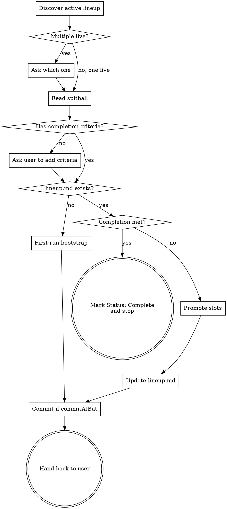

# Lineup: Review the Next Three Batters

Manages a small rolling state document next to a spitball. The spitball
owns the destination (the W). The lineup owns the next three batters: At
Bat (concrete), On Deck (fuzzy), In the Hole (very fuzzy). This skill
reads current state and updates the lineup. It does NOT do the work -
that is `at-bat`.

<HARD-GATE>
This skill never writes code and never plans more than one new In the
Hole bullet per cycle. When invoked at the end of an at-bat run, it
MUST verify the just-completed at-bat's Definition of done before
promoting (see "Verification mode" below). It MAY invoke `at-bat` at
the end of the hand-back, and only when the user has opted in via
`autoContinue` (`"always"`, `"session"` for this conversation, or
`"yes"` at the per-handoff prompt). It NEVER invokes any other
implementation skill. The user always drives the loop - `autoContinue`
is a shortcut for typing the next command, not a license to chain.
</HARD-GATE>

## Output rule: ASCII only

All files this skill writes (`lineup.md`, at-bat files, commit messages, user-facing prose) MUST use ASCII characters only. No emoji, no em-dashes, no curly quotes, no arrows, no non-breaking spaces. Use `-` for dashes, `->` for the At Bat pointer, `"` and `'` for quotes, `...` for ellipses. This keeps content portable across editors, terminals, and operating systems.

## Anti-patterns

- **"Let me show you the whole roadmap."** No. Three slots, hard cap.
  Anything past In the Hole is in the dugout. The user can ask explicitly
  to see further out, but the default is three.
- **"This is small, I'll just implement it now."** No. The lineup skill
  only updates the lineup. If you find yourself wanting to write code,
  stop and tell the user to invoke `at-bat`.
- **"The In the Hole slot must be the last batter."** No. The lineup
  never reaches the end of itself. Completion is owned by the spitball.

## Checklist

Create a task for each item and complete in order:

1. **Discover active lineup.** Run
   `python3 ${CLAUDE_PLUGIN_ROOT}/scripts/resolve-config.py` once. Parse
   the JSON for `effectiveSaveDir`, `commitAtBat`, `autoContinue`,
   `repoRoot`, and `liveSpitballs` (an array of `{name, path, mtime}` for every folder
   under `effectiveSaveDir` that has a `spitball.md` and is not marked
   `Status: Complete`, sorted by mtime descending - most recently
   touched first). If exit code is non-zero, the cwd is not in a git
   repo while `nestUnderRepoName: true` - refuse and tell the user.

   **Try to infer the target from chat context before asking.** Look at
   the conversation so far: did the user just run `/spitball` and create
   a folder? Did they mention a slug, topic, or path that matches a
   `liveSpitballs[*].name`? If a clear match exists, announce it ("Picking
   up the `<name>` spitball from earlier in this chat - say if that's
   wrong.") and use it without prompting. Inference rules:
   - Exact slug or path match in recent messages -> use it, announce.
   - Topic words match a folder name (e.g., user said "the auth
     rewrite" and `2026-05-04-auth-rewrite` is live) -> use it, announce.
   - The most recent message in this session was a `/spitball`
     hand-back referencing a folder under `effectiveSaveDir` -> use it,
     announce.
   - Ambiguous or no chat signal -> fall through to the rules below.

   Without a chat-context match:
   - Zero `liveSpitballs` -> stop and tell the user to run spitball first.
   - Exactly one -> use it.
   - Multiple -> list the names (most recent first) and ask the user
     which one to operate on.
2. **Verify spitball.md exists** in the target folder. If not, refuse
   to operate; tell the user lineup requires a spitball anchor.
3. **Read the spitball.** Identify the completion criteria. If the
   spitball doesn't state explicit completion criteria, ask the user to
   add them to the spitball before continuing - lineup can't determine
   "done" without them.
4. **Read or create `lineup.md`.** If absent, this is the first lineup
   cycle for this spitball: see "First-run bootstrap" below.
5. **Verification mode (when invoked from at-bat).** If the immediately
   prior assistant turn was an at-bat hand-back ("At-bat NNN finished -
   handing to lineup for verification"), verify that at-bat's
   Definition of done before promoting. See "Verification mode" below.
   If verification fails, stop with a failure report; do NOT promote
   and do NOT write to `lineup.md`. If verification passes, continue.
   When invoked directly by the user (no at-bat hand-back in the prior
   turn), skip this step - the user is asserting prior state is correct.
6. **Check completion.** Compare current state (codebase, recent
   commits, completed at-bats) against the spitball's completion
   criteria. If met -> write `Status: Complete` at the top of `lineup.md`
   and stop. Tell the user the spitball is delivered.
7. **Promote.** Otherwise:
   - Promote On Deck -> At Bat. Create the next `NNN-<slug>.md` file in
     the lineup folder with the full required structure (see "At-bat
     file structure" below). Counter is the next unused integer for this
     folder; never reuse, never reset.
   - Promote In the Hole -> On Deck (inline bullet in `lineup.md`).
   - Draft a new In the Hole bullet. Exactly one. No more.
8. **Update `lineup.md`.** Replace the At Bat pointer with the new file
   name. Update the On Deck and In the Hole bullets. Append the
   previously-completed at-bat to the Completed list (its file should
   already be in `completed/` - that move is `at-bat`'s job, not yours).
9. **Commit if `commitAtBat` is true** (default). Commit the new at-bat
   file and the updated `lineup.md` together with a short message like
   `Lineup: promote NNN-<slug>`. The lineup file lives alongside the
   at-bat work in the loop's commit history, so it shares the same flag.
10. **Hand back to user.** End your message with a hand-back block in
   EXACTLY this shape so the call-to-action is impossible to miss:

   ```
   ## Lineup sharpened

   <2-4 bullet summary of what changed: new At Bat, On Deck, In the Hole,
   commit state>

   ---

   **Next step:** run `/at-bat` to play NNN-<slug>.
   ```

   On first-run bootstrap, replace the header with `## Lineup bootstrapped`
   and the summary with the three slots you just filled. On completion,
   replace the block with a `## Spitball delivered` header and skip the
   Next step line - the loop is over.

   The `---` rule and bold **Next step:** line are required - they are
   the visual anchor that tells the user the loop is paused waiting for
   them.

   **Honor `autoContinue`** (from step 1's helper output, or from earlier
   in this conversation if the user said "session" at a prior prompt):

   - `"never"` -> end with the hand-back block above and stop. The user
     types `/at-bat` themselves.
   - `"prompt"` (default) -> after the hand-back block, ask:
     `Continue to /at-bat? (yes / session / always / no)`. On `yes` ->
     invoke at-bat now. On `session` -> invoke at-bat now and treat
     `autoContinue` as `"always"` for the rest of this conversation. On
     `always` -> invoke at-bat now AND write `autoContinue: "always"`
     into `<repoRoot>/.spitball.json` (creating it if absent), so the
     setting persists across sessions for this repo. On `no` -> stop.
   - `"always"` -> skip the prompt, just invoke at-bat directly after the
     hand-back block. The user can interrupt at any time.

   This is the only place lineup may invoke at-bat. The hard gate above
   stays in force everywhere else: never auto-invoke when the user
   hasn't opted in via `autoContinue`.

## First-run bootstrap

If `lineup.md` does not exist yet for a spitball:

1. Read the spitball carefully. Identify the first concrete unit of work
   the user could plausibly do toward the destination.
2. Identify two more units, progressively fuzzier.
3. Create `lineup.md` with all three slots filled:
   - **At Bat**: pointer to a new `001-<slug>.md` file (which you create
     with the full structure).
   - **On Deck**: inline bullet, fuzzy.
   - **In the Hole**: inline bullet, very fuzzy.
4. Confirm with the user before committing. First-run bootstrapping is
   the one place the reviewer is making structural decisions; the user
   should approve the initial three slots.

## Verification mode

When step 5 detects you were invoked from at-bat (the prior assistant
turn ended with "At-bat NNN finished - handing to lineup for
verification"), run these checks before promoting:

1. **Locate the at-bat file.** The just-completed at-bat is the
   most-recently-modified file in `completed/` for the active lineup.
   Confirm it exists and that the lineup folder's `lineup.md` still
   references it as At Bat (i.e., at-bat moved the file but lineup hasn't
   yet updated the pointer - that's exactly the state lineup is here to
   resolve).
2. **Read the Definition of done section.** Each line is a criterion to
   check.
3. **Verify each criterion concretely.** Don't just read; check.
   - File-existence claims -> confirm the file exists.
   - Build claims (`dotnet build` clean, `npm run build` succeeds) ->
     re-run the named command. Capture exit status.
   - Test claims -> re-run the named test command.
   - Grep claims (e.g., "no remaining `StaticPlugin*` references") ->
     re-run the grep.
   - Behavior claims that can't be checked from CLI -> ask the user to
     confirm the manual step. Don't silently mark "done."
4. **Verify the at-bat's Scope boundary.** Glance at the diff (or
   `git status` since the prior commit, if `commitAtBat: true` was on)
   and confirm nothing listed in the Scope boundary's Out section was
   touched. If something Out was touched, that's a verification failure.
5. **Decide.**
   - All criteria met, scope respected -> continue to step 6 (Check
     completion). Note in your hand-back: "Verified at-bat NNN: <list of
     checks that passed>."
   - Any criterion fails -> STOP. Output a verification-failure report:
     header `## Verification failed for at-bat NNN`, list of failed
     checks with specifics (command output, missing files, scope leaks).
     Do NOT update `lineup.md`. Do NOT promote. Do NOT invoke at-bat.
     The user fixes the issue and re-invokes lineup, or moves the file
     back out of `completed/` to redo the at-bat.

When invoked directly by the user (no at-bat hand-back in the prior
turn), skip verification - the user is asserting the prior state.

## At-bat file structure

When you create a new at-bat file (`NNN-<slug>.md`), it MUST contain:

```markdown
# At-Bat NNN: <title>

## What
<concrete description of the unit of work>

## Definition of done
<observable outcome that proves "done">

## Test plan
- Red: <a failing test that captures "done">
- Green: <expected behavior when it passes>

## Scope boundary
- In: <thing>
- Out: <related thing we are NOT touching here>

## Dependencies
- <prior at-bat or external thing>
```

If the work genuinely cannot be tested (pure docs, no-behavior config,
exploratory spike), replace the Test plan section with explicit honesty:

```markdown
## Test plan
- No automated test: <reason>
- Manual verification: <concrete steps>
```

**You MUST push back** on the no-test escape if the at-bat *could* be
tested. The escape is for cases where automated testing genuinely doesn't
fit, not for cases where it's inconvenient.

## `lineup.md` structure

```markdown
# Lineup: <topic>

Spitball: spitball.md

## At Bat
-> NNN-<slug>.md

## On Deck
- <fuzzy bullet, one sentence>

## In the Hole
- <very fuzzy bullet, one sentence>

## Completed
- NNN-<slug>.md
- NNN-<slug>.md
```

When the spitball's completion criteria are met, prepend `Status:
Complete` as the first line of the file. That marker is how a lineup
becomes inactive - there is no separate metadata.

## Process Flow


```dot
digraph lineup {
    "Discover active lineup" [shape=box];
    "Multiple live?" [shape=diamond];
    "Ask which one" [shape=box];
    "Read spitball" [shape=box];
    "Has completion criteria?" [shape=diamond];
    "Ask user to add criteria" [shape=box];
    "lineup.md exists?" [shape=diamond];
    "First-run bootstrap" [shape=box];
    "Completion met?" [shape=diamond];
    "Mark Status: Complete\nand stop" [shape=doublecircle];
    "Promote slots" [shape=box];
    "Update lineup.md" [shape=box];
    "Commit if commitAtBat" [shape=box];
    "Hand back to user" [shape=doublecircle];

    "Discover active lineup" -> "Multiple live?";
    "Multiple live?" -> "Ask which one" [label="yes"];
    "Multiple live?" -> "Read spitball" [label="no, one live"];
    "Ask which one" -> "Read spitball";
    "Read spitball" -> "Has completion criteria?";
    "Has completion criteria?" -> "Ask user to add criteria" [label="no"];
    "Has completion criteria?" -> "lineup.md exists?" [label="yes"];
    "Ask user to add criteria" -> "lineup.md exists?";
    "lineup.md exists?" -> "First-run bootstrap" [label="no"];
    "lineup.md exists?" -> "Completion met?" [label="yes"];
    "First-run bootstrap" -> "Commit if commitAtBat";
    "Completion met?" -> "Mark Status: Complete\nand stop" [label="yes"];
    "Completion met?" -> "Promote slots" [label="no"];
    "Promote slots" -> "Update lineup.md";
    "Update lineup.md" -> "Commit if commitAtBat";
    "Commit if commitAtBat" -> "Hand back to user";
}
```

## Counter rules

- The counter is monotonic per lineup folder.
- The next counter is `max(NNN across all files in the folder + completed/) + 1`.
- Counters are zero-padded to three digits (`001`, `002`, ..., `099`,
  `100`).
- If a counter is abandoned (file deleted before completion), do NOT
  reuse it. The next promotion gets the next integer.

## Configuration

Run `python3 ${CLAUDE_PLUGIN_ROOT}/scripts/resolve-config.py` to get the
merged config. The script reads `~/.spitball.json` and
`<repoRoot>/.spitball.json` over defaults, derives the repo name, and
returns JSON. See the spitball plugin's `configuration.md` for the
schema. Lineup uses these fields from the script output:

- `effectiveSaveDir` - directory to scan for spitball folders. Already
  includes the `<repo-name>` subfolder when `nestUnderRepoName: true`.
- `liveSpitballs` - pre-computed list of folders with a non-complete
  `spitball.md`, sorted most-recently-touched first. Used for chat-
  context inference of the target spitball.
- `commitAtBat` - whether to commit the new at-bat file and updated
  `lineup.md` after promotion (default `true`).
- `autoContinue` - `"never"` / `"prompt"` (default) / `"always"`.
  Governs whether lineup invokes at-bat after promotion. See step 10's
  hand-back rules.
- `repoRoot` - repo root path (used for staging files relative to the
  repo).

There is no `.lineup.json`. Lineup shares spitball's config.

## Key principles

- **Three slots, hard cap.** Never four. Never two. Always exactly three
  (after the first promotion; first-run bootstrap also creates exactly
  three).
- **Filesystem is truth.** No pointer files, no json tracking, no
  metadata sidecar. The folder structure and the markdown contents are
  the state.
- **Spitball owns completion.** You read the criteria; you don't define
  them. If the spitball lacks criteria, push it back to the user.
- **Honest about uncertainty.** On Deck is fuzzy on purpose. In the Hole
  is fuzzier on purpose. Don't write paragraphs about either - a
  sentence per slot is the budget.
- **Never auto-invoke at-bat.** The skill ends with the lineup
  sharpened. The user picks up from there.
