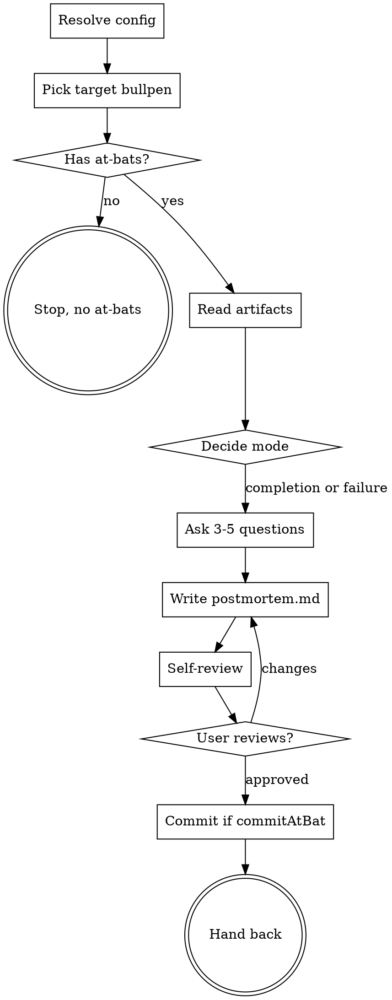

# Postmortem: Reflect On A Bullpen's At-Bats

Looks back over a bullpen and the at-bats executed against it, captures
what we learned, and writes a small `postmortem.md` artifact next to
`bullpen.md`. Pairs with `lineup` and `at-bat`: those drive the work
forward, this looks back.

<HARD-GATE>
This skill never writes code, never invokes `lineup` or `at-bat`, and
never modifies `bullpen.md` or `lineup.md`. It reads existing artifacts
and writes exactly one new file: `postmortem.md` in the bullpen folder
(or `postmortem-NNN.md` if one already exists). It does not advance the
loop in any direction.
</HARD-GATE>

## Output rule: ASCII only

All files this skill writes (`postmortem.md`, commit messages,
user-facing prose) MUST use ASCII characters only. No emoji, no
em-dashes, no curly quotes, no arrows, no non-breaking spaces. Use `-`
for dashes, `->` for arrows, `"` and `'` for quotes, `...` for ellipses.

## When to use

- A bullpen was delivered (lineup.md starts with `Status: Complete`),
  and the user wants to reflect before moving on.
- Mid-flight reflection: the user explicitly asks for one even though
  the bullpen isn't complete (rare but valid).
- Failure mode: something went wrong (verification failed, an at-bat
  regressed, the design didn't survive contact). The user invokes
  postmortem to capture cause and prevention.

The skill picks up the right mode from chat context. If unclear, ask
once: "Completion postmortem (looking back over a delivered bullpen)
or failure postmortem (something broke; what was the cause)?"

## Anti-patterns

- **"Let me write the whole epic."** No. The postmortem is short and
  honest: 3-5 sections, each a few sentences. If a section has nothing
  honest to say, write "Nothing notable" and move on. Don't pad.
- **"Score the team."** No. The postmortem is about the work and the
  process, not about who did what. Names appear only when concretely
  useful for follow-up.
- **"Recommend a giant refactor."** No. The carry-forward section is
  for patterns to repeat or traps to avoid in the next bullpen.
  Concrete next-bullpen suggestions live in the user's head until they
  open `/bullpen`. Don't try to write the next plan here.
- **"Speculate on root cause without evidence."** In failure mode,
  point at the commits, the at-bat files, the test output, the build
  logs. If you don't have evidence, say "unknown" rather than guess.

## Checklist

Create a task for each item and complete in order:

1. **Resolve config.** Run
   `python3 ${CLAUDE_PLUGIN_ROOT}/scripts/resolve-config.py` once. Parse
   the JSON for `effectiveSaveDir`, `commitAtBat`, `repoRoot`,
   `liveBullpens`, and `completedBullpens`. If exit code is
   non-zero, the cwd is not in a git repo while `nestUnderRepoName:
   true` - refuse and tell the user.

2. **Pick the target bullpen.** Try chat-context inference first (same
   rules as lineup's discovery): exact slug or path, topic words
   matching a folder name, the most recent `/bullpen` or `/lineup` or
   `/at-bat` invocation. If matched, announce and proceed.

   Without a chat match, use the two pre-computed lists from step 1:
   - **Completed**: `completedBullpens` - folders inside
     `<effectiveSaveDir>/completed/` (archived by lineup on
     completion), plus any legacy top-level folders whose `lineup.md`
     starts with `Status: Complete` that haven't been moved yet.
   - **Live**: `liveBullpens` - folders at the top level of
     `<effectiveSaveDir>` whose `lineup.md` does not start with
     `Status: Complete` (or has no `lineup.md`).

   Default rules:
   - Zero candidates -> stop and tell the user no bullpen folder was
     found.
   - Exactly one (live or completed) -> use it.
   - Multiple -> list candidates with their status (live vs complete)
     sorted by mtime descending and ask which to operate on.

3. **Verify the folder has at-bats to reflect on.** Look for either a
   `completed/` directory with at least one `NNN-*.md` file, or
   numbered at-bat files (`NNN-*.md`) at the folder root. If neither
   exists, stop and tell the user: "There are no at-bats to look back
   on. The postmortem skill operates on at-bat history. If you want to
   reflect on the bullpen alone, open the file and write notes
   directly." Do NOT proceed with an at-bat-less postmortem.

4. **Read the artifacts.**
   - `bullpen.md` - the design and completion criteria.
   - `lineup.md` - current state (or final state if completed).
   - All `NNN-*.md` files in `completed/` and at the folder root - the
     executed at-bats. Pay particular attention to each at-bat's
     `## Notes` section if present - that's where in-flight surprises,
     stop-triggers, user redirections, and `(bullpen-level)` signals
     were captured during the loop. Those notes are usually the most
     concentrated source of postmortem material, since chat context
     gets cleared between sessions but Notes survive.
   - Optional: `git log --oneline` for commits touching this folder
     (`git log -- <effectiveSaveDir>/<folder>/`) and commits in the
     `repoRoot` from the bullpen's start date forward, scoped to paths
     touched by the at-bats. Use these to ground claims about what
     shipped.

5. **Decide the mode.**
   - **Completion mode**: lineup.md starts with `Status: Complete`, or
     the user said "wrap up" / "deliver" / "retro the bullpen." This
     is the default.
   - **Failure mode**: the user said "verification failed" / "regressed"
     / "broke" / "what went wrong," or there's a `## Verification
     failed` block in a recent at-bat or in chat context. Use a slightly
     different question set (see "Failure mode questions" below).

6. **Ask reflection questions one at a time.** 3-5 questions max. Wait
   for each answer before moving on. Multiple-choice when a useful
   shape exists; open-ended otherwise. The questions should be
   *informed* by what you read in step 4 - if `001-foo.md` was
   completed but `002-bar.md` ballooned into 5 commits, ask about
   sizing on bar specifically. Generic questions are weak; pointed
   ones surface useful insight.

   See the `questions.md` sidecar (referenced under "Question library"
   below) for starting points. Pick the 3-5 most relevant; do not ask
   all of them.

7. **Synthesize and write `postmortem.md`** to the bullpen folder. If
   `postmortem.md` already exists, write `postmortem-002.md` (next
   unused integer; never overwrite a previous postmortem). Use the
   template sidecar (see "Templates" below). Anchor every claim
   in concrete evidence: at-bat file names, commit short SHAs, test
   output snippets. Avoid abstract praise or blame.

8. **Self-review.** Re-read what you wrote. Look for:
   - Padding ("the team did a great job") - cut.
   - Speculation framed as fact - either anchor it or mark as "unknown."
   - Sections with nothing honest to say - replace with "Nothing
     notable" rather than fabrication.
   - Action items disguised as observations - if it's an action, list
     it under Carry-forward; if it's not, drop it.

9. **User reviews.** Ask the user to read the file before stopping:

   > "Postmortem written to `<path>`. Please review and tell me if you
   > want any changes."

   If they request changes, edit and re-run step 8. Only stop when they
   approve.

10. **Commit if `commitAtBat` is true** (default). The postmortem lives
    in the bullpen folder alongside the at-bat history; it shares the
    at-bat commit flag, not the bullpen-doc commit flag (which only
    governs the original bullpen write). Use a short commit message
    like `Postmortem: <topic>`. If `commitAtBat` is false, leave it for
    the user.

11. **Hand back to user.** End with a short closing block in EXACTLY
    this shape:

    ```
    ## Postmortem written

    <1-3 bullets summarizing the most useful insight - what to carry
    forward, what to avoid>
    ```

    Do NOT add a "Next step" line. The postmortem is terminal. The user
    decides whether to start a new bullpen, return to existing work,
    or close the loop here.

## Question library

The starter set of reflection questions for both modes lives in
`${CLAUDE_PLUGIN_ROOT}/skills/postmortem/questions.md`. Read it when
you reach step 6 of the checklist (asking questions). Pick 3-5 from
the relevant mode's list and tailor each to specific evidence (at-bat
numbers, commit SHAs, file paths). Don't ask all of them - the
sidecar is a menu, not a script.

## Templates

Write `postmortem.md` (or `postmortem-NNN.md` if one already exists in
the folder). Two skeletons, picked by mode:

- Completion mode -> see
  `${CLAUDE_PLUGIN_ROOT}/skills/postmortem/templates/postmortem-completion.md`
- Failure mode -> see
  `${CLAUDE_PLUGIN_ROOT}/skills/postmortem/templates/postmortem-failure.md`

Read the template only when you're about to write the file - sidecars
are not loaded by default.

Anchor every claim in concrete evidence: at-bat file names, commit
short SHAs, test output snippets. Sections may be omitted when truly
empty; write "Nothing notable" if the section was asked but had no
real content. Don't fabricate.

## Process Flow



## Configuration

Run `python3 ${CLAUDE_PLUGIN_ROOT}/scripts/resolve-config.py` to get the
merged config. Postmortem uses these fields:

- `effectiveSaveDir` - directory to scan for bullpen folders.
- `liveBullpens` - top-level non-complete folders (mid-flight
  reflection or rare in-progress postmortems).
- `completedBullpens` - folders in the archive bucket
  (`<effectiveSaveDir>/completed/`) plus any legacy top-level
  completed folders. The default postmortem target.
- `commitAtBat` - whether to commit the postmortem.md after writing
  (postmortem lives in the at-bat-history side of the folder, so it
  rides the at-bat commit flag, not the bullpen-doc flag).
- `repoRoot` - repo root path (used for staging files relative to the
  repo).

There is no `.postmortem.json`. Postmortem shares bullpen's config.

## Key principles

- **Anchored, not abstract.** Every claim points at a file, a commit,
  or a test. Vague reflection is theater.
- **Short.** A postmortem under one printed page is more useful than a
  long one. Resist the urge to compose.
- **No next plan.** This is the look-back. The look-forward starts when
  the user opens `/bullpen` again.
- **Honest about unknowns.** "We don't know why X happened" is a
  legitimate finding. Mark it and move on.
- **Never auto-invoke.** Postmortem is terminal. Do not chain into
  bullpen, lineup, or at-bat at the end.
