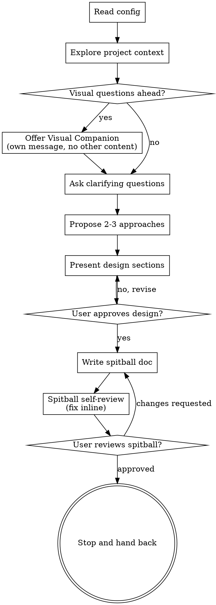

# Spitball: Ideas Into Designs

Help turn ideas into fully formed designs through natural collaborative dialogue. The output is a small artifact called a *spitball*: a design captured at the depth we honestly know it, no further. We don't write hundreds of lines of forward plan that won't survive contact with reality.

Start by understanding the current project context, then ask questions one at a time to refine the idea. Once you understand what you're building, present the design and get user approval.

<HARD-GATE>
Do NOT invoke any implementation skill, write any code, scaffold any project, or take any implementation action until you have presented a design and the user has approved it. This applies to EVERY project regardless of perceived simplicity.
</HARD-GATE>

## Anti-Pattern: "This Is Too Simple To Need A Design"

Every project goes through this process. A todo list, a single-function utility, a config change, all of them. "Simple" projects are where unexamined assumptions cause the most wasted work. The design can be short (a few sentences for truly simple projects), but you MUST present it and get approval.

## Checklist

You MUST create a task for each of these items and complete them in order:

1. **Read configuration** - look for `.spitball.json` at the repo root. If present, use the `saveDir` value. If absent, fall back to the default save directory `docs/spitballs/`. See `configuration.md` for the schema.
2. **Explore project context** - check files, docs, recent commits.
3. **Offer visual companion** (if topic will involve visual questions). This is its own message, not combined with a clarifying question. See the Visual Companion section below.
4. **Ask clarifying questions** - one at a time, understand purpose, constraints, success criteria.
5. **Propose 2-3 approaches** with trade-offs and your recommendation.
6. **Present design** in sections scaled to their complexity, get user approval after each section.
7. **Write spitball doc** - save to `<saveDir>/YYYY-MM-DD-<topic>-spitball.md` and commit.
8. **Spitball self-review** - quick inline check for placeholders, contradictions, ambiguity, scope (see below).
9. **User reviews written spitball** - ask user to review the file before stopping.
10. **Stop.** Do not auto-invoke any planning or implementation skill. Hand back control to the user.

## Process Flow

**The terminal state is stopping.** Do NOT invoke `writing-plans`, `north-star-planning`, `frontend-design`, `mcp-builder`, or any other skill at the end. Spitball ends with the artifact saved and the user back in control. The user decides if and when to make any handoff.

## The Process

**Understanding the idea:**

- Check out the current project state first (files, docs, recent commits).
- Before asking detailed questions, assess scope: if the request describes multiple independent subsystems (e.g., "build a platform with chat, file storage, billing, and analytics"), flag this immediately. Don't spend questions refining details of a project that needs to be decomposed first.
- If the project is too large for a single spitball, help the user decompose into sub-projects: what are the independent pieces, how do they relate, what order should they be built? Then spitball the first sub-project through the normal design flow. Each sub-project gets its own spitball cycle.
- For appropriately-scoped projects, ask questions one at a time to refine the idea.
- Prefer multiple choice questions when possible, but open-ended is fine too.
- Only one question per message. If a topic needs more exploration, break it into multiple questions.
- Focus on understanding: purpose, constraints, success criteria.

**Exploring approaches:**

- Propose 2-3 different approaches with trade-offs.
- Present options conversationally with your recommendation and reasoning.
- Lead with your recommended option and explain why.

**Presenting the design:**

- Once you believe you understand what you're building, present the design.
- Scale each section to its complexity: a few sentences if straightforward, up to 200-300 words if nuanced.
- Ask after each section whether it looks right so far.
- Cover: architecture, components, data flow, error handling, testing.
- Be ready to go back and clarify if something doesn't make sense.

**Right-sizing the artifact:**

- The spitball captures what we honestly know. Constraints we can name, decisions we have actually made, components we are confident about.
- It is not a forward plan. Do not enumerate phases, milestones, or timeline estimates that you are guessing at. Anything past what you actually know is theater.
- If a section is best expressed as "we will figure this out when we get there", say so and move on.
- A short, honest spitball beats a long, speculative one.

**Design for isolation and clarity:**

- Break the system into smaller units that each have one clear purpose, communicate through well-defined interfaces, and can be understood and tested independently.
- For each unit, you should be able to answer: what does it do, how do you use it, and what does it depend on?
- Can someone understand what a unit does without reading its internals? Can you change the internals without breaking consumers? If not, the boundaries need work.
- Smaller, well-bounded units are also easier for you to work with. You reason better about code you can hold in context at once, and your edits are more reliable when files are focused. When a file grows large, that is often a signal that it is doing too much.

**Working in existing codebases:**

- Explore the current structure before proposing changes. Follow existing patterns.
- Where existing code has problems that affect the work (e.g., a file that has grown too large, unclear boundaries, tangled responsibilities), include targeted improvements as part of the design, the way a good developer improves code they're working in.
- Don't propose unrelated refactoring. Stay focused on what serves the current goal.

## After the Design

**Documentation:**

- Write the validated spitball to `<saveDir>/YYYY-MM-DD-<topic>-spitball.md`, where `<saveDir>` came from `.spitball.json` or the default `docs/spitballs/`.
- Use `elements-of-style:writing-clearly-and-concisely` skill if available.
- Commit the spitball document to git.

**Spitball Self-Review:**
After writing the spitball document, look at it with fresh eyes:

1. **Placeholder scan:** Any "TBD", "TODO", incomplete sections, or vague requirements? Fix them.
2. **Internal consistency:** Do any sections contradict each other? Does the architecture match the feature descriptions?
3. **Scope check:** Is this focused enough for a single piece of work, or does it need decomposition?
4. **Ambiguity check:** Could any requirement be interpreted two different ways? If so, pick one and make it explicit.
5. **Speculation check:** Anything written as if known that is actually a guess? Either remove it or mark it explicitly as speculation.

Fix any issues inline. No need to re-review, just fix and move on.

**User Review Gate:**
After the spitball review loop passes, ask the user to review the written file before stopping:

> "Spitball written and committed to `<path>`. Please review it and let me know if you want to make any changes. When you are ready to start work or build a plan, kick off the next thing yourself."

Wait for the user's response. If they request changes, make them and re-run the review loop. Only stop once the user approves.

**Handing off:**

- The spitball ends here. Do NOT invoke any planning or implementation skill.
- If the user has a follow-up planning skill they prefer (for example, `north-star-planning` or `writing-plans`), they will invoke it themselves.

## Key Principles

- **One question at a time.** Don't overwhelm with multiple questions.
- **Multiple choice preferred.** Easier to answer than open-ended when possible.
- **YAGNI ruthlessly.** Remove unnecessary features from all designs.
- **Explore alternatives.** Always propose 2-3 approaches before settling.
- **Incremental validation.** Present design, get approval before moving on.
- **Be flexible.** Go back and clarify when something doesn't make sense.
- **Honest about uncertainty.** A spitball captures what we know, not what we're guessing.

## Visual Companion

A browser-based companion for showing mockups, diagrams, and visual options during a spitball. Available as a tool, not a mode. Accepting the companion means it is available for questions that benefit from visual treatment; it does NOT mean every question goes through the browser.

**Offering the companion:** When you anticipate that upcoming questions will involve visual content (mockups, layouts, diagrams), offer it once for consent:
> "Some of what we're working on might be easier to explain if I can show it to you in a web browser. I can put together mockups, diagrams, comparisons, and other visuals as we go. This feature is still new and can be token-intensive. Want to try it? (Requires opening a local URL)"

**This offer MUST be its own message.** Do not combine it with clarifying questions, context summaries, or any other content. The message should contain ONLY the offer above and nothing else. Wait for the user's response before continuing. If they decline, proceed with text-only spitballing.

**Per-question decision:** Even after the user accepts, decide FOR EACH QUESTION whether to use the browser or the terminal. The test: **would the user understand this better by seeing it than reading it?**

- **Use the browser** for content that IS visual: mockups, wireframes, layout comparisons, architecture diagrams, side-by-side visual designs.
- **Use the terminal** for content that is text: requirements questions, conceptual choices, tradeoff lists, A/B/C/D text options, scope decisions.

A question about a UI topic is not automatically a visual question. "What does personality mean in this context?" is a conceptual question, use the terminal. "Which wizard layout works better?" is a visual question, use the browser.

If they agree to the companion, read the detailed guide before proceeding:
`visual-companion.md`
